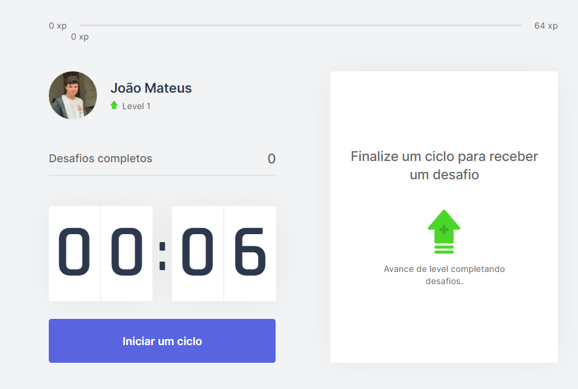

# Moveit - Web Site

Este projeto esta sendo desenvolvido para fins de estudo, o projeto trata-se da aplicação [Moveit](https://moveit-5luwr38va-mateusgcoelho.vercel.app) em versão web criada em Next.js para trazer um pouco de produtividade e saúde para seu dia, dividindo seu tempo e criando desafios para se movimentar e manter os olhos e o corpo bem, todos sabemos como programadores ficam horas em um computador certo?

## Tecnologias Utilizadas

- [x] Next.js
- [x] TypeScript
- [x] React

## Aprendizado

O projeto me deu uma otima base de Next.js, getServerSideProps, Contexts, Components, e mostrou a facilidade que é criar uma interface com a tecnologia de maneira simples e organizada, alem de trazer inumeras possibilidades de aplicações diferentes.

## Demonstração em imagens

    
    
    
    
    

